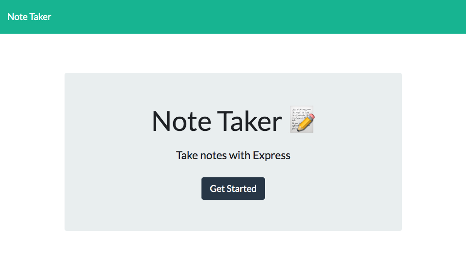

  

# **Note Taker**

  ## Table of Contents
  1. [Description](#description)
  2. [Usage](#usage)
  2. [Installation](#installation)
  3. [Screenshots](#screenshots)
  3. [Deployed Application](#deployed-application)
  4. [License](#license)
  5. [Questions](#questions)

### Description

Application allows user to write and save notes, so they can organize thoughts and keep track of tasks that need to be completed.

### Usage

- HTML
- CSS
- Javascript
- Node.js
- Express.js
- Heroku

### Installation

npm i

### Screenshots

### Deployed-Application

[Click to view Live Website on Heroku](link goes here "Note-Taker")

### License

This application is covered under the [MIT](https://opensource.org/licenses/MIT) license.
  
### Questions

Github Username: **Rajendra-Dhanraj**

[Click to follow and view my Github profile!](https://github.com/Rajendra-Dhanraj) 

Alternatively, I can be contacted via email: **Rajendra.Dhanraj@gmail.com**
  